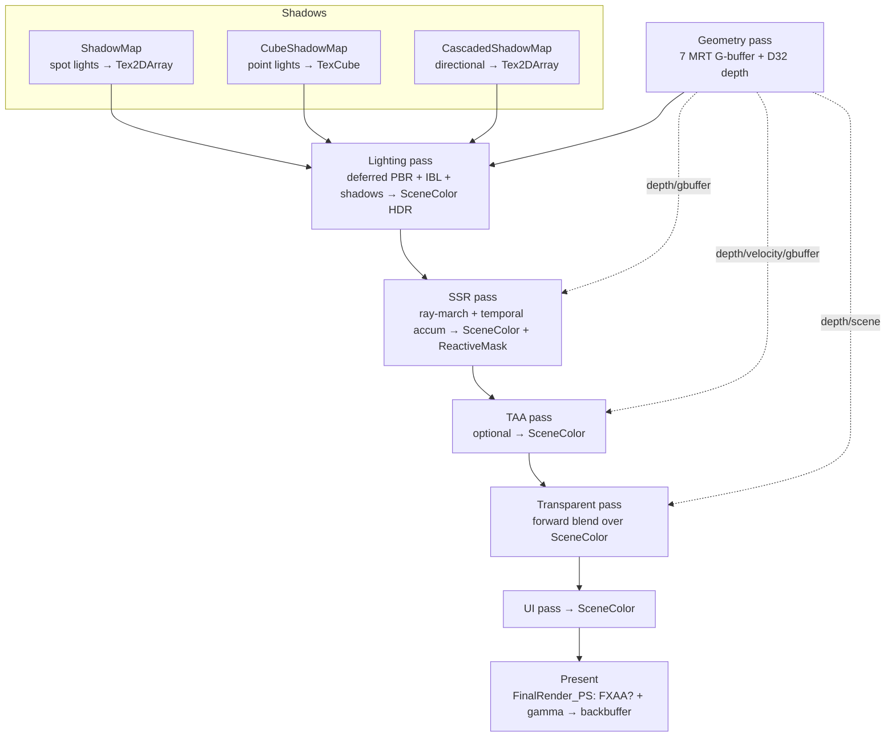

# DX12Engine — 3D Rendering Architecture: A Deep Analysis

*A technical report on how the renderer works, how it compares to other engines, where it is strong, where it is weak, the bugs it currently carries, and where it should go next.*

---

## 1. Executive summary

DX12Engine is a **clustered-less, deferred, physically-based renderer** built directly on Direct3D 12 with a data-driven, frame-graph-lite pass system. For a single-author/learning-oriented engine it is unusually complete: it ships a full G-buffer deferred pipeline, image-based lighting with a clearcoat lobe, three shadowing techniques (spot 2D, point cube, cascaded directional), screen-space reflections with temporal accumulation, a hand-written TAA resolve with variance clipping and dilated velocity, discrete LOD selection with hysteresis, frustum culling, and a data-driven render-pass graph that automatically wires producers to consumers and re-creates transient targets on resize.

The technique *quality* is well above the typical tutorial renderer and lands somewhere in the **intermediate-to-advanced hobby** tier. The main things separating it from a production engine are not the effects — those are respectable — but the **execution/scale layer**: a strictly serialized single-frame-in-flight submission model that prevents CPU/GPU overlap, a hard limit of **four total lights** with single-slot shadowing, a **fat 52-byte G-buffer**, the **absence of tone mapping/exposure**, and a handful of concrete correctness bugs (PSO cache hash truncation, spot-shadow indexing, light-buffer overflow).

The rest of this document walks the pipeline in detail, then collects strengths, weaknesses, bugs (with fixes), and a roadmap.

---

## 2. The frame at a glance

The demo (`DemoScene/src/DX12EngineDemoApp.cpp:154`) builds this pass graph, executed in order by `Renderer::ExecutePipeline` (`src/DX12Engine/Rendering/Renderer.cpp:206`):



Key structural facts:

- **Deferred core, forward tail.** Opaque geometry is deferred (G-buffer → single full-screen lighting resolve). Transparent geometry is drawn afterward in a **forward** pass that copies the resolved scene and alpha-blends over it (`TransparentRenderPass.cpp:78`).
- **Post-order.** SSR and TAA operate on the HDR `SceneColor` before transparents. Transparents therefore receive **no TAA and no SSR** — a deliberate, common tradeoff (transparents lack motion vectors), but worth knowing.
- **Present is a blit.** The final image is produced by a full-screen triangle in `Renderer::PresentFrame` running `FinalRender_PS` (optional FXAA + gamma), sampling the last pass's `Composite` target (`Renderer.cpp:571`).

---

## 3. Device, swap chain, and the frame lifecycle

### 3.1 Setup
`RenderContext` creates the device at **feature level 11.0** (`RenderContext.cpp:52`), a `CommandQueueManager`, a `DescriptorHeapManager`, and a `GPUUploader`. The swap chain is **double-buffered, `FLIP_DISCARD`, `R8G8B8A8_UNORM`, windowed, vsync on** (`RenderWindow.cpp:63`, `Present(1,0)` at `RenderWindow.cpp:128`).

### 3.2 The submission model — the single most important performance characteristic

Each render pass records into the graphics queue's command list and **submits its own command list** at the end of `Execute()` (e.g. `GeometryRenderPass.cpp:165`, `LightingRenderPass.cpp:108`). The next pass calls `ResetCommandAllocatorAndList()` (`RenderPass::Execute`, `RenderPass.cpp:79`), which rotates through a pool of **8 command allocators** (`CommandQueue.cpp:11`) and only CPU-waits if none is free.

At the end of the frame, `PresentFrame` does:

```cpp
UINT fenceVal = ...ExecuteCommandList();
m_RenderContext->PresentFrame();               // Present(1,0)
m_QueueManager.GetGraphicsQueue().WaitForFenceCPUBlocking(fenceVal);  // full stall
```
`Renderer.cpp:606`

This means: **the CPU blocks until the GPU has finished the entire frame before starting the next one.** Even though the swap chain is double-buffered and the descriptor heap/allocators are sized for `FRAMES_IN_FLIGHT`, the per-frame CPU stall makes the engine effectively **single-frame-in-flight**: the GPU is idle while the CPU records, and the CPU is idle while the GPU executes. There is **no CPU/GPU overlap across frames**.

There is a second, subtler consequence: the full-frame stall is currently **load-bearing for correctness**. Per-object constant buffers (`RenderComponent::Init`, `RenderComponent.cpp:29`), the light buffer, and the screen buffer are each a **single** upload-heap resource that is rewritten every frame. That is only safe because the GPU is guaranteed done with last frame's copy before the CPU overwrites it. You cannot simply "add frames in flight" without also double/triple-buffering every dynamic constant buffer.

### 3.3 Uploads are synchronous too
`GPUUploader::ExecuteUpload` (`GPUUploader.cpp:105`) executes the copy-queue list, **CPU-waits** for it, executes a graphics-queue barrier list, and **CPU-waits again**. So any frame that streams in a new texture (first sighting of a material) triggers two full CPU stalls mid-frame. Vertex/index/constant creation goes through the same path.

**Net:** the architecture is *correct* and easy to reason about, but its throughput ceiling is roughly half of a pipelined design, and texture streaming produces visible hitches.

---

## 4. Geometry pass and the G-buffer

### 4.1 Layout
`GeometryRenderPass::Init` (`GeometryRenderPass.cpp:29`) creates **five color render targets plus a depth target**:

| Slot | Format | Bytes/px | Contents |
|------|--------|---------:|----------|
| Albedo | `R8G8B8A8_UNORM` | 4 | base color (linearized), alpha |
| Normals | `R16G16B16A16_UNORM` | 8 | octahedral world normal in `.xy`, geometric normal in `.zw` |
| Material | `R8G8B8A8_UNORM` | 4 | roughness, metallic, clearcoat, clearcoatRoughness |
| Emissive | `R16G16B16A16_FLOAT` | 8 | emissive rgb + **AO in alpha** |
| Velocity | `R16G16_FLOAT` | 4 | screen-space motion vector |
| Depth | `D32_FLOAT` | 4 | hardware depth |

**Total ≈ 32 bytes/pixel.** At 1080p that is **~66 MB** for the G-buffer, before SceneColor, two SSR history buffers, two TAA history buffers, the reactive mask, and the transparent scene copy — all full-resolution `R16G16B16A16_FLOAT`.

This layout is the result of the slimming pass described in `docs/GBuffer-Slimming-Guide.md`, which took it from 8 targets at 52 bytes/pixel (~107 MB at 1080p):

- **Position was deleted.** World position is reconstructed from depth and the inverse projection by `ReconstructWorldPos` in `Shaders/Common/GBufferUtils.hlsli`, shared by the lighting and SSR passes. This is also a *precision* win: half-float world coordinates quantise to worse than a unit past a few thousand units from the origin, while `D32_FLOAT` run back through the inverse projection stays sub-millimetre.
- **The two normal targets became one.** Both normals are octahedral-encoded to two channels (`PackNormal`/`UnpackNormal`, same header) and share a single `R16G16B16A16_UNORM` target. `UNORM` rather than `FLOAT16` because octahedral mapping wants uniform precision across its range, not exponent range it will never use; angular error is ~0.1° at 16 bits.
- **Material narrowed to `RGBA8`.** All four channels are `[0,1]` and every consumer already `saturate()`s them on read.

Because oct pairs must not be filtered — interpolating them across a silhouette or the fold decodes to a direction belonging to neither surface — G-buffer normal fetches go through the `LoadMap`/`LoadWorldNormal` point-load helpers rather than the pass's anisotropic sampler.

Each render-target format is declared in **three** places that must agree: the `RenderTextureConfig` in `GeometryRenderPass::Init`, the `SetRenderTargets` list in `GeometryRenderPass::CreatePSO`, and a duplicate of that list in `MaterialTemplate::BuildPSODesc` (`MaterialTemplate.cpp:109`). A mismatch in the third fails per-material and reads as a material bug.

### 4.2 Vertex path and motion vectors
`Geometry_VS` (`Shaders/Geometry_VS.hlsl`) transforms with a jittered `MVPMatrix` for rasterization but carries **both** an *unjittered* current clip and the previous-frame unjittered clip. `Geometry_PS` computes the velocity from the **unjittered** current/previous NDC (`Geometry_PS.hlsl:101`). This is the correct way to avoid baking TAA jitter into motion vectors — a genuinely nice detail. The previous-MVP is tracked per primitive binding, and reset when the object was frustum-culled last frame (`Renderer.cpp:476`) so re-appearing objects don't emit a bogus velocity spike.

Tangent space uses a stored handedness sign (`Vertex.Tangent.w`) and reconstructs the bitangent with `cross(N,T)*w` (`Geometry_VS.hlsl:49`), so mirrored UVs are handled correctly.

### 4.3 Draw submission
`Renderer::SetSceneData` builds `DrawItem`s and sorts opaque items by **(PSO key, material, mesh, CBV address)** (`Renderer.cpp:493`) to minimize state changes, shadow items the same way, and transparent items **back-to-front by object-center distance** (`Renderer.cpp:510`). The geometry pass then binds lazily, skipping redundant PSO/root-sig/CBV/material/VB-IB sets (`GeometryRenderPass.cpp:92`). This is textbook sort-then-batch and is done well. Materials can carry their own PSO variant via `MaterialTemplate`, falling back to the pass's default PSO when none is resolved.

---

## 5. Shading model (deferred PBR + IBL)

The resolve is `PBRLightingDeferred_PS` (`Shaders/PBRLightingDeferred_PS.hlsl`) drawn as a single full-screen triangle.

**Analytic lighting** (`PBRShading.hlsli`) is standard Cook-Torrance: GGX/Trowbridge-Reitz NDF, Schlick-GGX geometry with the `(r+1)²/8` direct-lighting `k`, Schlick Fresnel, `F0 = lerp(0.04, albedo, metallic)`. On top of the base lobe there is a **glTF-style clearcoat** second specular lobe with fixed `F0≈0.04` and base-layer energy attenuation (`ClearcoatSpecLobe`). This is a real, correct extension most hobby engines never add.

**Image-based lighting:** diffuse from an irradiance cubemap, specular from the environment cubemap sampled at `roughness*12` mip (`PBRLightingDeferred_PS.hlsl:104`), Fresnel-roughness split, plus a **specular-occlusion** term (`SpecularOcclusion`) that keeps polished metals from glowing in shadow. The environment reflection is a prefiltered-mip approximation rather than a proper split-sum BRDF LUT.

**Light types:** directional (with CSM), point (inverse-square with a windowing falloff, cube-map PCF shadow), spot (cone falloff, 2D PCF shadow). The shadow term is folded into an "ambient shadow" that also darkens the IBL contribution via a smooth remap (`PBRLightingDeferred_PS.hlsl:155`) — a pragmatic hack to fake shadowing of ambient light without an AO/GI pass.

**Sky:** pixels at far depth sample the environment cubemap directly (`PBRLightingDeferred_PS.hlsl:88`).

### Gaps in the shading model
- **No BRDF integration LUT** (split-sum): the env specular is `prefiltered * kS * (1-roughness)²`, an ad-hoc energy term rather than the standard `prefiltered * (F0*scale + bias)`. Visually plausible, not energy-correct.
- **`MAX_LIGHTS 4`** (`PBRLightingDeferred_PS.hlsl:1`). The lighting loop is a flat iteration over at most four lights. There is no tiling/clustering, so this cannot scale to many lights. This is the single biggest *capability* limitation of the renderer.
- **`sRGBToLinear` uses `pow(x,2.2)`** rather than the exact piecewise sRGB curve — universally fine, just noting it.

---

## 6. Shadows

Three separate systems feed the lighting pass:

**Spot lights → `ShadowMapRenderPass` (2D).** One `SHADOW_MAP_SIZE = 2048` slice of a `Texture2DArray` per spot light (`ShadowMapRenderPass.cpp:34`), rendered with a fixed depth bias (const 1000, slope 1.5) and `CULL_MODE_NONE`. Sampled with a **16-tap Poisson-disk PCF** comparison sampler (`ShadowSampling.hlsli:4`).

**Point lights → cube shadow.** Six `LookAtLH` faces per light rendered into cube slices, distance stored normalized by far plane; sampled with a 3×3 PCF (`ShadowSampling.hlsli:47`).

**Directional → `CascadedShadowMapRenderPass`.** This is the most sophisticated piece. It computes **logarithmic/uniform blended split distances** (`SplitLambda`), fits each cascade to its frustum-slice bounding sphere, and applies **texel-snapping** (rounding the light-space center to whole texels, `CascadedShadowMapRenderPass.cpp:250`) to kill shadow swimming under camera motion. Sampling (`CascadedShadowSampling.hlsli`) uses per-cascade normal bias + slope-scaled depth bias, 16-tap Poisson PCF, and **smooth inter-cascade blending** across a configurable band. This is production-grade CSM logic.

### Shadow issues
- **Point shadows: only one caster is usable.** The lighting shader binds a **single `TextureCube shadowCubeMap`** (`PBRLightingDeferred_PS.hlsl:49`), while the cube pass writes `6*count` slices (`ShadowMapRenderPass.cpp:200`). A second shadow-casting point light's faces are simply never sampled. See Bug 3.
- **Spot shadow indexing is by global light index.** See Bug 2 — a real correctness bug under mixed light ordering.
- **No reverse-Z.** The camera uses a standard LH perspective with depth clear 1.0 and `LESS` test (`Camera.cpp:115`). Both the main scene and shadows would benefit in precision from a reverse-Z (`D32`, `GREATER`) setup, which is nearly free.

---

## 7. Screen-space reflections

`SSRPass_PS` (`Shaders/SSRPass_PS.hlsl`) is the most ambitious shader in the codebase and is genuinely advanced:

- **View-space ray setup** with a roughness-driven **cone jitter** perturbed by interleaved-gradient noise, so temporal accumulation fills the glossy cone over time.
- **Linear march (up to 200 steps) with adaptive stride and thickness, then a 6-iteration binary-search refinement** to tighten the hit and reduce tunneling (`SSRPass_PS.hlsl:182`).
- **Hit validation and confidence:** backface rejection, screen-edge fade, ray-length fade, normal-mismatch/cross-surface heuristics, and a "recursive hotspot suppression" term to stop bright receivers from feeding back into themselves.
- **Temporal accumulation** in dedicated ping-pong HDR history buffers with reprojection, **neighborhood color clamping**, and **depth-disocclusion rejection** (`SSRPass_PS.hlsl:564`).
- **Fallback to the prefiltered environment** cubemap when the ray misses, weighted so shadowed regions don't double-count the ambient specular that the lighting pass already added (`SSRPass_PS.hlsl:396`).
- Writes a **reactive mask** for TAA to consume.

It is a screen-space, single-layer reflection (no hierarchical-Z acceleration; the 200-step linear march is brute force), and much of the tuning is heuristic. But the feature set — refinement, validation, temporal reuse, roughness cones, env fallback — is what you'd expect from a competent modern SSR, not a tutorial one.

---

## 8. Temporal anti-aliasing

`TAAPass_PS` (`Shaders/TAAPass_PS.hlsl`) plus `Renderer::UpdateFrameJitter` (`Renderer.cpp:110`):

- **Halton(2,3) jitter** over a 4-sample cycle applied to the projection matrix; the CPU also scales jitter by frame time for stability (`Renderer.cpp:383`).
- **Dilated velocity** (closest-depth neighbor in 3×3) to give thin edges the right motion vector.
- **Catmull-Rom history reconstruction** (`SampleHistoryCatmullRom`) instead of bilinear — sharper history, less over-blur.
- **Variance clipping** (`mean ± γ·σ`) rather than raw min/max neighborhood clamping, with γ adapted by motion and reactivity.
- **Adaptive history weight** driven by velocity, depth disagreement, contrast, edges, disocclusion, and the SSR-provided reactive mask; plus motion-gated post-sharpening.
- **History reset** on camera cuts (matrix/position deltas) and resize (`TAARenderPass.cpp:98`).

This is a well-rounded TAA that mirrors the standard modern recipe (INSIDE/UE4-era). It is not TSR/DLSS-class (no upscaling, no neural component), and the reactive-mask heuristics are hand-tuned, but it is a solid implementation.

---

## 9. Post-processing and present

The final present pass (`FinalRender_PS.hlsl`) offers a full **FXAA 3.11-style** implementation (edge detect, edge search, sub-pixel aliasing) plus optional gamma. AA mode is exclusive: `None`, `FXAA` (present-time), or `TAA` (dedicated pass) — `Renderer::UpdatePostProcessingCB` wires the flags.

**The conspicuous gap: there is no tone mapping and no exposure.** The pipeline is HDR end-to-end (`R16G16B16A16_FLOAT` intermediates), and then the present pass samples that HDR buffer and does only `pow(color, 1/2.2)` (`FinalRender_PS.hlsl:155`). Any luminance above 1.0 — bright emissives, sun-lit metal, strong point lights — **clips hard to white** with hue shifts. A single ACES/Reinhard/AgX operator (a few lines) would dramatically improve image quality and is the highest-value visual fix available. There is also no bloom, which is what normally sells emissive/HDR content.

A minor ordering nit: FXAA runs on the **linear** HDR buffer *before* gamma. FXAA's luma thresholds were designed for perceptual/gamma-encoded input, so quality is slightly off; encoding first then AA would be more correct.

---

## 10. Resource and descriptor management

### 10.1 Descriptor streaming (a strength)
`DescriptorHeapManager` (`Heaps/DescriptorHeapManager.h`) splits descriptors into:
- a **persistent, non-shader-visible "staging" heap** (`SRV_PERSISTENT_CAPACITY = 1024`) holding one stable SRV per resource for its lifetime, and
- a **shader-visible "render-pass" heap** (`SRV_TRANSIENT_CAPACITY_FRAME = 512`, times `FRAMES_IN_FLIGHT`) that is bump-allocated per frame.

Each frame, `ResourceManager::UpdateSRVDescriptors` (`ResourceManager.cpp:546`) allocates a contiguous transient block and `CopyDescriptorsSimple` from each resource's persistent slot into it, then hands the pass a GPU handle for its table. `RenderPass::RebuildTransientDescriptors` (`RenderPass.cpp:31`) computes per-block base handles by offset so one pass's copies cannot clobber another's.

This is a clean, robust model that sidesteps the usual "one giant heap + manual ring + fences" hazards. Its cost is a `CopyDescriptors` per bound resource per frame; the production alternative is a **persistent bindless heap** where descriptors are written once and shaders index by integer, eliminating the per-frame copies. Debug builds even track heap high-water marks and warn at 80%/95% (`Renderer.cpp:611`) — a nice touch.

### 10.2 PSO / root-signature caches
`PipelineStateCache` and `RootSignatureCache` hash-and-cache by content. The root-sig cache hashes its fields properly. **The PSO cache does not** — see Bug 1. There is also no on-disk `ID3D12PipelineLibrary`, so every PSO recompiles on cold start (fine at this scale). In `_DEBUG`, shaders hot-reload: `ResourceManager::ReloadChangedShaders` bumps a generation counter that forces PSOs to rebuild and passes to recreate — a great iteration feature.

### 10.3 Constant buffers
Every primitive binding gets its **own committed upload-heap constant buffer** (`RenderComponent.cpp:29`). Committed CBs are 64 KB-aligned minimum, so a scene with hundreds of primitives wastes tens of MB and does hundreds of small allocations. The standard fix is a per-frame **linear/ring constant allocator** (one big upload buffer, sub-allocated). As noted in §3.2, these single-buffered CBs are also why the full-frame stall can't be removed in isolation.

---

## 11. Culling and LOD

- **Frustum culling** via `DirectXCollision` OBBs: each primitive's oriented bounding box is transformed by the model matrix each frame (`MeshPrimitive::ComputeOrientedBoundingBox`) and tested against the camera frustum (`Renderer.cpp:467`). Culled objects skip the opaque/transparent lists but **still** go into the shadow list (correct — off-screen casters can shadow on-screen receivers).
- **Discrete LOD with hysteresis** (`Renderer.cpp:67`): a screen-space size metric (projected radius / distance·tan(fov)) selects a LOD level, with separate enter/exit thresholds so objects don't oscillate between levels at a boundary. LOD index buffers are produced offline by the `AssetCooker` via mesh simplification.

Both are single-threaded and per-object on the CPU. There is **no occlusion culling** (no HZB / predication) and **no GPU-driven culling** (no `ExecuteIndirect`), so draw-call scaling is CPU-bound.

---

## 12. Comparison to other engines

| Capability | DX12Engine | UE5 | Unity HDRP | Godot 4 | Typical tutorial engine |
|---|---|---|---|---|---|
| Lighting arch | Deferred, **≤4 lights**, no tiling | Clustered deferred (thousands) | Tiled/clustered deferred+forward | Clustered Forward+ | Usually forward, few lights |
| GI | SSR only | **Lumen** (SW/HW RT GI) | SSGI/APV/ray tracing | SDFGI/VoxelGI | None |
| Reflections | Custom SSR + env fallback | Lumen reflections + SSR | SSR + reflection probes | SSR + probes | Rarely any |
| Shadows | Spot 2D, point cube, CSM | Virtual Shadow Maps | CSM + contact + RT | CSM/PSSM | Basic single shadow map |
| AA / upscaling | Custom TAA / FXAA | **TSR**, DLSS/FSR/XeSS | TAA + DLSS/FSR | TAA/FSR | None/MSAA |
| Tone mapping | **None** (gamma only) | ACES/AgX, auto-exposure, bloom | ACES + full grading | Filmic/AgX + glow | None |
| Geometry LOD | Discrete + hysteresis | **Nanite** virtualized | LOD groups | Discrete/visibility | None |
| Frame graph | Data-driven, manual barriers | **RDG** auto barriers + transient aliasing + async compute | SRP RenderGraph | RenderingDevice graph | None |
| Submission | 1 frame in flight, per-pass submit, CPU-blocking | Fully pipelined, multi-threaded, async compute | Pipelined + jobs | Pipelined | Often 1 frame, blocking |
| Bindless | No (copy-streaming) | Yes | Yes | Partial | No |

**Reading of the comparison:** the engine's *shading and post feature list* (PBR + clearcoat + IBL, CSM, SSR, TAA, LOD, frame-graph-lite) is comfortably ahead of tutorial-tier renderers and reaches into UE4-era territory for individual techniques. Where it is generationally behind production engines is exactly where production engines invested the last decade: **light scalability (clustering), global illumination, virtualized geometry/shadows, GPU-driven submission, and a pipelined/async execution layer.** Its closest philosophical relative is a well-built personal "modern deferred renderer" — the tier above a learning project, below a shippable engine.

---

## 13. Strengths

1. **Data-driven pass graph.** `RenderPipelineConfig` + `CreateRenderPipeline` (`Renderer.cpp:231`) auto-wire pass outputs to inputs via a producer map, inject fallbacks (env map, reactive mask, CSM CB), and remap every transient target on resize (`RenderPass::OnResize`, `Renderer::OnResize`). Adding/removing a pass is a config edit, not a rewrite.
2. **Correct, thoughtful temporal tech.** Unjittered motion vectors, dilated velocity, variance clipping, Catmull-Rom history, reactive masks, and camera-cut resets show real understanding of TAA/SSR failure modes — not copy-paste.
3. **Production-quality CSM.** Sphere-fit cascades, texel snapping, log/uniform split blend, cross-cascade blending, separable bias controls.
4. **Clean descriptor architecture.** Persistent-staging + transient-copy is robust and self-instrumented with heap stats/warnings.
5. **State-change-minimizing draw path.** Multi-key sort + lazy binding + material PSO variants + LOD-aware IB switching.
6. **Good engineering hygiene.** Shader hot-reload with PSO/pass invalidation, offline asset cooking (mips + LODs + material manifests) with an incremental cache, resize correctness with explicit GPU drains, and debug-layer enablement.

---

## 14. Weaknesses (non-bug, by impact)

1. **No CPU/GPU frame overlap** (§3.2). Biggest performance ceiling; ~2× throughput left on the table.
2. **≤4 lights, no clustering** (§5). Biggest capability ceiling.
3. **No tone mapping / exposure / bloom** (§9). Biggest *visual* deficit; cheapest to fix.
4. ~~**Fat 52-byte G-buffer** with redundant position + dual full-fat normals.~~ **Done** — slimmed to 32 bytes/pixel (§4.1).
5. **Per-primitive committed constant buffers** (§10.3). Memory + allocation overhead; blocks pipelining.
6. **Synchronous, CPU-blocking uploads** (§3.3). Streaming hitches.
7. **No compute shaders anywhere.** SSR/TAA/lighting/downsampling are all pixel-shader full-screen passes; the `_CS` loader path exists but no compute shader is shipped. Compute would be faster and enable HZB/clustering/mip-gen.
8. **No occlusion or GPU-driven culling** (§11). CPU-bound draw scaling.
9. **Single-threaded command recording.** One graphics command stream; no parallel pass recording, no async compute queue use for shadows/SSR.
10. **No reverse-Z** (§6). Free depth-precision win being left unclaimed.
11. **RenderWindow's D24S8 depth buffer appears unused** by the deferred pipeline (geometry builds its own D32; present uses no depth) — likely a dead allocation worth removing (`RenderWindow.cpp:99`).

---

## 15. Bugs (with suggested fixes)

### Bug 1 — PSO cache hashes only the first 8 bytes of rasterizer/blend/depth state *(latent correctness)*
`PipelineStateCache::HashPSO` (`PipelineStateCache.h:70`):
```cpp
HashCombine(seed, std::hash<uint64_t>()(*(const uint64_t*)&desc.RasterizerState));
HashCombine(seed, std::hash<uint64_t>()(*(const uint64_t*)&desc.BlendState));
HashCombine(seed, std::hash<uint64_t>()(*(const uint64_t*)&desc.DepthStencilState));
```
Only the first 8 bytes of each struct are hashed:
- **Rasterizer:** captures `FillMode`+`CullMode`, **misses** `DepthBias`, `SlopeScaledDepthBias`, `DepthClipEnable`, `FrontCounterClockwise`, etc.
- **Blend:** captures only `AlphaToCoverageEnable`+`IndependentBlendEnable`, **misses all** `RenderTarget[0]` blend config.
- **Depth-stencil:** captures `DepthEnable`+`DepthWriteMask`, **misses** `DepthFunc` and all stencil state.

**Impact:** two PSOs that share VS/PS + RTV/DSV formats + topology but differ only in depth bias, blend mode, or depth func **hash-collide**, and the cache returns whichever was built first. This is directly reachable through the material system: `MaterialTemplate::RebuildPipelineKey` treats `DepthBias` and `BlendPolicy` as *distinct* pipeline keys (`MaterialTemplate.cpp:139`), so the engine sorts them as different pipelines — but the PSO cache hands them the *same* PSO. Result: a material that expects, say, a polygon-offset or a blend mode silently gets another material's pipeline.

**Fix:** hash the *entire* relevant descriptor. Either hash the full byte range of each POD sub-struct (loop over `sizeof(desc.RasterizerState)`), or hash each field explicitly. Also fold in `desc.pRootSignature`, `desc.InputLayout`, `desc.PrimitiveTopologyType` (already), and `desc.NumRenderTargets`. Cheapest robust option:
```cpp
auto hashBytes = [&](const void* p, size_t n){
    const auto* b = static_cast<const unsigned char*>(p);
    for (size_t i=0;i<n;++i) HashCombine(seed, b[i]);
};
hashBytes(&desc.RasterizerState,   sizeof(desc.RasterizerState));
hashBytes(&desc.BlendState,        sizeof(desc.BlendState));
hashBytes(&desc.DepthStencilState, sizeof(desc.DepthStencilState));
HashCombine(seed, reinterpret_cast<uintptr_t>(desc.pRootSignature));
```

### Bug 2 — Spot-light shadows are indexed by *global* light index *(correctness)*
In `PBRLightingDeferred_PS.hlsl:147`, for a spot light at loop index `i` over **all** lights:
```cpp
shadowFactor = ShadowPCF(i, lightSpacePosition, 2.0);   // samples shadowMaps[i]
```
But the `shadowMaps` `Texture2DArray` is filled by `ShadowMapRenderPass` with **one slice per spot light**, indexed 0..(numSpots-1) in the order returned by `GetLightsByType({Spot})` (`ShadowMapRenderPass.cpp:73`). The global light index `i` equals the spot-slice index **only when spot lights occupy the leading entries** of the light list. With any directional/point light ordered before a spot (as is typical), `i` over-indexes the array and the spot samples the wrong slice or an out-of-range layer (PCF then early-outs to "lit").

**Fix:** give each `LightData` a `ShadowIndex` (its slice within its type's atlas), assigned when the light buffer is built, and sample `ShadowPCF(light.ShadowIndex, …)`. This also generalizes cleanly to Bug 3.

### Bug 3 — Only one shadow-casting point light is representable *(correctness/limitation)*
The lighting shader binds a single `TextureCube shadowCubeMap` (`PBRLightingDeferred_PS.hlsl:49`) and `PointLightShadowPCF` samples it directly, while the cube pass renders `6*count` slices into a cube-*array*-shaped resource (`ShadowMapRenderPass.cpp:200`, slice `j + 6*lightIndex`). Only the first light's six faces are visible through a plain `TextureCube` view; any second point light samples the first light's cube.

**Fix:** bind a `TextureCubeArray` and index by the point light's shadow slot (per Bug 2's `ShadowIndex`). Pair with an `arraySize = 6*count` SRV.

### Bug 4 — Light buffer overflows past 4 lights *(memory corruption)*
`LightBufferData::Lights` is a fixed `LightData Lights[4]` (`LightBuffer.h:13`). `LightBuffer::AddLight` does:
```cpp
m_LightsBufferData.Lights[m_LightsBufferData.LightCount++] = light->GetLightData();  // no bound check
```
`LightBuffer.cpp:31`. Adding a **5th** light writes out of bounds, corrupting adjacent memory. `Update()` (`LightBuffer.cpp:21`) similarly loops `LightCount` with no clamp.

**Fix (minimum):** guard `AddLight` with `if (LightCount >= MAX_LIGHTS) return;` and assert. **Fix (proper):** move lights to a `StructuredBuffer<LightData>` sized at runtime, drop the `[4]` cap, and combine with clustered light assignment to lift the 4-light ceiling entirely.

### Bug 5 (minor) — FXAA operates in linear space
`FinalRender_PS.hlsl:152` runs FXAA on the linear HDR sample, then applies gamma. FXAA's luma-based thresholds assume perceptual/gamma input. **Fix:** apply tone map + gamma first, then FXAA on the encoded result (or compute FXAA luma in gamma space). This becomes moot once a tone-map stage exists (see roadmap).

---

## 16. Recommended future direction

Ordered by value-to-effort.

### Tier 1 — cheap, high impact
1. **Add a tone-mapping + exposure stage** (ACES or AgX) and reorder present to `resolve → tonemap → encode → FXAA`. Biggest visual upgrade for the least code. Optionally add **bloom** (a downsample/upsample chain) to sell emissives.
2. **Fix Bugs 1–4.** All are small, localized, and either latent-correctness or memory-safety.
3. **Reverse-Z.** Switch projection to reverse depth, clear to 0, `GREATER` test; near-free precision win for both camera and CSM.

### Tier 2 — architectural, unlocks the ceiling
4. **Real frame pipelining.** Double/triple-buffer the dynamic constant buffers (see #6), remove the per-frame `WaitForFenceCPUBlocking`, and gate on the swap-chain back-buffer fence instead. Target CPU/GPU overlap.
5. **Per-frame ring constant allocator.** Replace per-primitive committed CBs with one large upload buffer, sub-allocated per draw, N-buffered. Prerequisite for #4 and a large memory/alloc win.
6. ~~**Slim the G-buffer.**~~ **Done.** Position reconstructed from depth, both normals octahedral-encoded into one `RGBA16_UNORM` target, material narrowed to `RGBA8`: 8 targets at 52 B/px → 6 at 32 B/px, a 38% reduction (§4.1, `docs/GBuffer-Slimming-Guide.md`).
7. **Async, batched uploads.** Keep uploads on the copy queue but make them fence-based/non-blocking; use a barrier on first-use rather than a synchronous graphics stall.

### Tier 3 — scale and modernization
8. **Clustered/tiled lighting** with a `StructuredBuffer` light list to lift the 4-light limit into the hundreds/thousands; combine with the light-buffer rework from Bug 4.
9. **Move full-screen passes to compute** (lighting, SSR, TAA), add an **HZB** for SSR acceleration and future occlusion culling, and generate mips on-GPU.
10. **GPU-driven culling + `ExecuteIndirect`** and **multi-threaded / async-compute** command recording (shadows and SSR are natural async-compute candidates).
11. **Screen-space or ray-traced GI/AO** (even SSAO/GTAO would meaningfully improve grounding) as the next step beyond SSR-only indirect specular.

### Tier 4 — correctness/quality polish
12. **Split-sum BRDF LUT** for energy-correct IBL specular, replacing the ad-hoc `(1-roughness)²` weight.
13. **Order-independent or depth-peeled transparency**, or at least per-triangle-sorted transparents; current sorting is per-object-center only.
14. Remove the **unused D24S8 depth buffer** (`RenderWindow.cpp:99`) and audit other vestigial allocations.
15. **Resolve the quarter-texel nudge in depth reconstruction.** `ReconstructViewPos` (`Shaders/Common/GBufferUtils.hlsli`) offsets clip-space by `0.5 / screenSize` before the `y` flip. One pixel spans `2 / screenSize` in NDC, so a half-texel correction would be `1 / screenSize` — this is a quarter texel, applied to both axes before the flip so they end up nudged in opposite directions. It was inherited verbatim from the pre-slimming `SSRPass_PS` so that the shared helper would be a provable no-op for SSR; SSR's heuristics are tuned around it. Worth fixing on its own, with SSR before/after screenshots in hand.

---

## 17. Closing assessment

This is a strong, coherent renderer that clearly reflects real graphics knowledge: the temporal techniques, CSM, and pass-graph design are the work of someone who understands *why* each trick exists, not just how to copy it. Its ceiling is set almost entirely by the **execution layer** — the serialized single-frame submission model, the fixed 4-light cap, and per-object committed buffers — rather than by the effects themselves. Fix the handful of concrete bugs, add a tone-mapping stage, and invest in frame pipelining + clustered lighting, and this moves decisively from "excellent learning renderer" toward "small but real engine."
